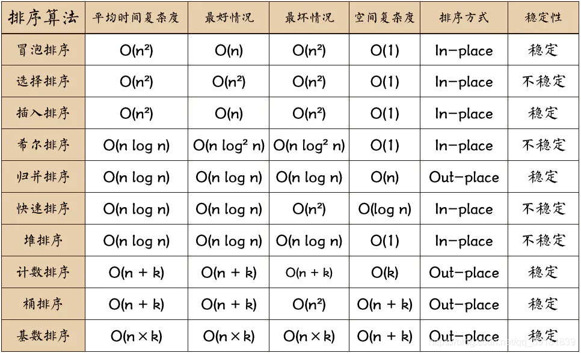

# computer_test_fd
`复旦机试复习`
## 常见算法
### 排序

#### 快排
```cpp
#include <iostream>
#include <vector>
int partition(std::vector<int>& arr, int low, int high) {
    int pivot = arr[low];
    int left = low + 1;
    int right = high;

    while(ture) {
        while(left<=right&&arr[left]<pivot) {
            left++;
        }
        while(left<=right&&arr[right]>pivot) {
            right--;
        }
        if(left<right) {
            std::swap(arr[left], arr[right]);
            left++;
            right--;
        }else{
            break;
        }
    }
    std::swap(arr[low], arr[right]);
    return right;
}
void quickSort(std::vector<int>& arr, int low, int hight) {
    if(low < high) {
        int pi = partition(arr, low, high);
        quickSort(arr, low, pi-1);
        quickSort(arr, pi+1, high);
    }
}
```

## C++处理用例输入输出
### 输入是本地文本
```cpp
// 打开文件
std::ifstream infile("test.txt");
if(!infile.is_open()) {
    std::cerr<<"无法打开文件"<<std::endl;
    return 1;
}
// 存储读取的每一行
std::string line;
while(inflie>>line) {
    # 使用stringstream存储每行内容，便于转换为其他类型数据
    std::stringstream ss(line);

    // 转化为int
    int num;
    std::vector<int> nums;
    while(ss>>num){
        nums.push_back(num);
    }

    // 转化为string
    std::string str;
    std::vector<string> strings;
    while(ss>>str) {
        strings.push_back(str);
    }

    // 转化为double
    double db;
    std::vector<double> doubles;
    while(ss>>db) {
        doubles.push_back(db);
    }
}

```
### 输入是命令行输入
```cpp
// 使用std::getline(std::cin, line)和std::stringstream ss(line)
    std::string line;
    while (std::getline(std::cin, line)) {
        if (line.empty()) {
            continue;
        }

        std::stringstream ss(line);
        std::vector<int> nums;
        int num;
        while (ss >> num) {
            nums.push_back(num);
        }

        processInput(nums);
    }
// 直接使用std::cin>>，但是会一次读取多行
    while(std::cin>>num) {
        nums.push_back(num);
    }
// 
```
## 21
1. `将 n 个正整数存放于一个一维数组中，编写一个程序，将数组中所有的奇数存放于所有的偶数之前，要求尽可能少用临时存储单元并使时间复杂度达到 O(n)。输入：一维数组；输出：符合要求的一维数组。`
2. `给定 n 个小区之间的交通图， 并用二维数组 A[n][n]表示，即若小区 i 与小区 j 之间有路，则 A[i][j]表示这条路的长度。现计划在这 n 个小区中选定一个小区建一所医院，使距离医院最远的小区到医院的路程尽可能缩短。编写一个程序解决上述问题。输入：二维数组；输出：建医院的小区。`
3. 


